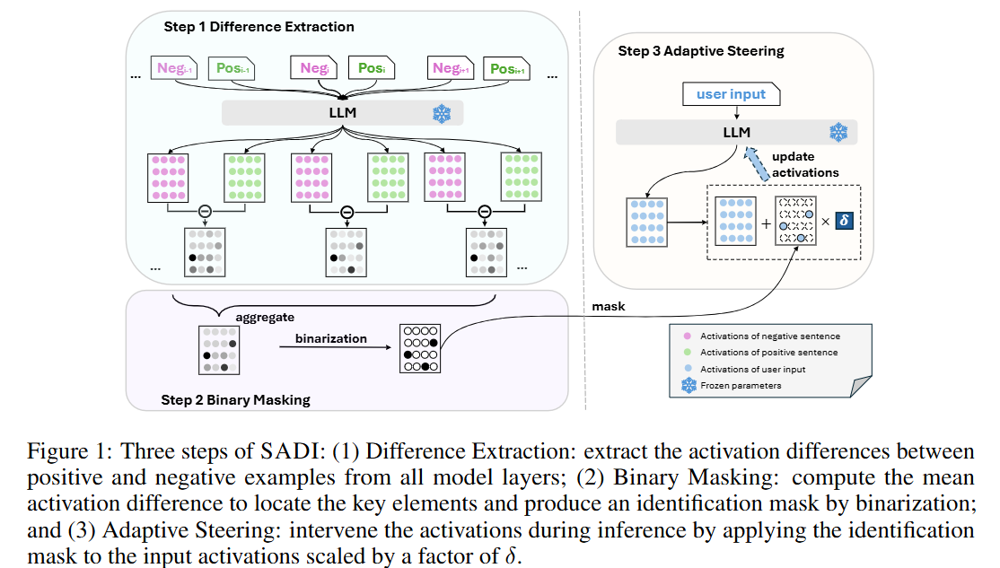
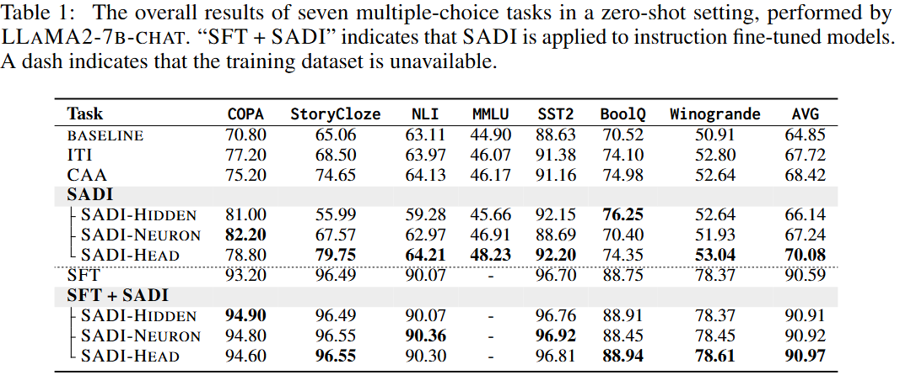
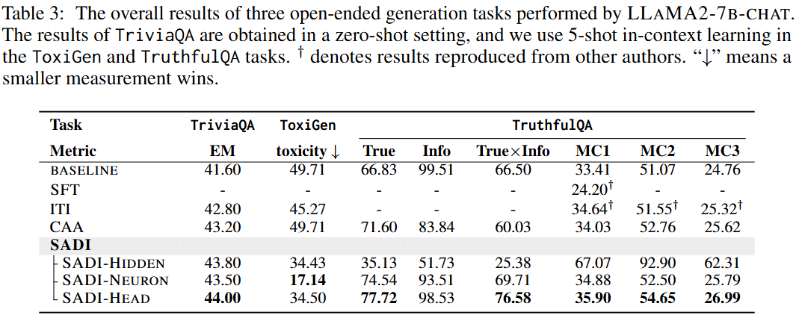
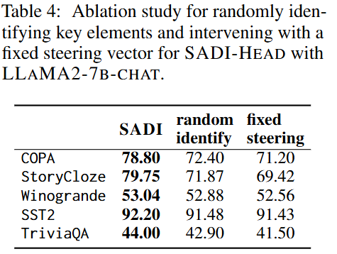
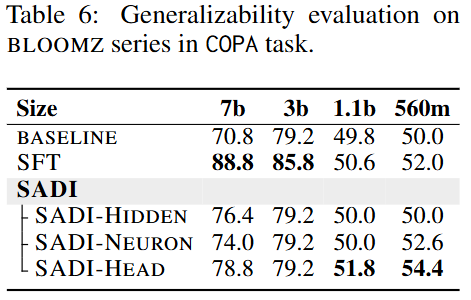
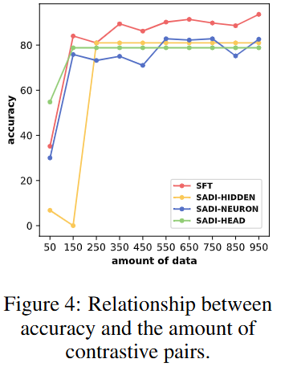

<h1 align=center>Semantics-Adaptive Activation Intervention for LLMs via Dynamic Steering Vectors</h1>

<h3 align=center>Weixuan Wang, Jingyuan Yang, Wei Peng


<h2 align=center>Abstract</h2>

Large language models (LLMs) have achieved remarkable performance across many tasks, yet aligning them with desired behaviors remains challenging. Activation intervention has emerged as an effective and economical method to modify the behavior of LLMs. Despite considerable interest in this area, current intervention methods exclusively employ a fixed steering vector to modify model activations, lacking adaptability to diverse input semantics. To address this limitation, we propose **Semantics-Adaptive Dynamic Intervention (SADI)**, a novel method that constructs a dynamic steering vector to intervene model activations at inference time. More specifically, SADI utilizes activation differences in contrastive pairs to precisely identify critical elements of an LLM (i.e., attention heads, hidden states, and neurons) for targeted intervention. During inference, SADI dynamically steers model behavior by scaling element-wise activations based on the directions of input semantics. Experimental results show that SADI outperforms established baselines by substantial margins, improving task performance without training. SADI's cost-effectiveness and generalizability across various LLM backbones and tasks highlight its potential as a versatile alignment technique. In addition, we release the code to foster research along this line: https://github.com/weixuan-wang123/SADI


<h2 align=center>Contribution</h2>

- We propose a **dynamic activation intervention** approach named Semantics-Adaptive Dynamic Intervention (SADI), which automatically modulates LLM activations at inference time to adapt to varied input semantics **without requiring any additional training**.

- SADI is a generic steering method **applicable to a wide range of LLMs**. Through extensive experiments with four model backbones over eleven diverse tasks, SADI has proven to significantly enhance model performance, surpassing baseline methods by substantial margins, with accuracy improvements reaching up to +14.69. Our detailed analysis demonstrates that interventions targeting attention heads **SADI-HEAD consistently yields significant performance improvements** across various tasks, validating the effectiveness of our dynamic steering approach. 

- SADI demonstrates excellent **generalizability across different model sizes, few-shot settings, and multilingual scenarios**. We further show that SADI is a **cost-effective steering method** that necessitates only a small number of additional examples (i.e., 150 items) in developing a dynamic steering vector and does not require any training.


<h2 align=center>Methodology</h2>

<table align="center">
<tr>
  <td width="80%" align="center" valign="middle"></td>
</tr>
</table>


SADI encompasses three pivotal steps to dynamically steer model behavior. 

- First, the activation differences between positive and negative examples are extracted across all layers of the model. These differences are aggregated to compute the mean difference, which is used to identify critical elements influencing the model’s behavior. 

- Based on this computation, we create an identification mask through binarization, keeping the crucial elements while masking out the insignificant ones. 

- Furthermore,  this mask is applied to the activations of user inputs, scaled by a factor during inference. In this way, we manage to manipulate the behaviors of LLMs. We present more details in the following sections. 


<h2 align=center>Experiments</h2>


<h3 align=center>Discriminative tasks</h3>

**SADI Significantly improves multiple-choice task performance.**

<table align="center">
<tr>
  <td width="80%" align="center" valign="middle"></td>
</tr>
</table>

**SADI improves open-ended generation task performance.**

<h3 align=center>Generative tasks</h3>

<table align="center">
<tr>
  <td width="80%" align="center" valign="middle"></td>
</tr>
</table>

**Improvement varies across SADI configurations.** Manipulating attention heads consistently results in improvements across all tasks and achieves the highest scores in most cases.


<h2 align=center>Discussion</h2>


**SADI outperforms fixed steering and random intervention.** The results in Table 4 show that using a fixed steering vector leads to significant performance degradation compared to the semantic-adaptive approach of SADI. This decline likely stems from a misalignment between the direction of intervention and that of input semantics. 


**SADI outperforms SFT in smaller LLMs.**  SADI outperforms SFT with incremental gains of up to +1.2 for BLOOMZ-1b1 and +2.4 for BLOOMZ-560m, highlighting its effectiveness, especially in smaller models.


<table align="center" align="center">
<tr align="center">
  <td width="50%" align="center" valign="middle"></td>
  <td width="50%" align="center" valign="middle"></td>
</tr>
</table>

<h2 align=center>Analysis</h2>

**SADI achieves optimal results with significantly fewer pairs**, e.g., only 150 items are sufficient to calculate an identification mask for targeting critical heads for intervention. This highlights SADI's effectiveness and efficiency in low-resource conditions. 


<table align="center">
<tr>
  <td width="80%" align="center" valign="middle"></td>
</tr>
</table>


<h2 align=center>Conclusion</h2>

In this study, we propose **Semantics-Adaptive Dynamic Intervention (SADI)**, a novel approach designed to dynamically steer model behavior by adapting to the semantic contexts of inputs. SADI enhances model adaptability by modulating the activations of the identified critical model elements during inference, taking into account the directions of input semantics. Our extensive experiments across various tasks, LLMs backbones, and languages settings have demonstrated that SADI significantly outperforms established baselines, offering generalizable improvements without requiring additional training. Our study advances the field of ``activation engineering'' in LLMs, with the potential to inform the development of more advanced LLM intervention techniques.


<h2 align=center>Bibtex</h2>

```
@article{wang2024semantics,
  title={Semantics-Adaptive Activation Intervention for LLMs via Dynamic Steering Vectors},
  author={Wang, Weixuan and Yang, Jingyuan and Peng, Wei},
  journal={arXiv preprint arXiv:2410.12299},
  year={2024}
}
```
